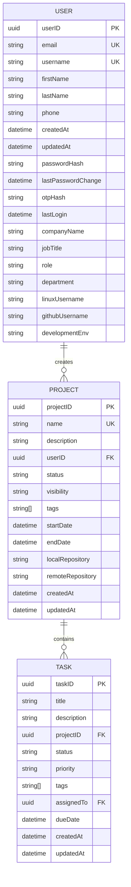

```mermaid
erDiagram
 direction TB
 USER {
  uuid userID PK ""
  string email UK ""
  string username UK ""
  string firstName  ""
  string lastName  ""
  string phone  ""
  datetime createdAt  ""
  datetime updatedAt  ""
  string passwordHash  ""
  datetime lastPasswordChange  ""
  string otpHash  ""
  datetime lastLogin  ""
  string companyName  ""
  string jobTitle  ""
  string role  ""
  string department  ""
  string linuxUsername  ""
  string githubUsername  ""
  string developmentEnv  ""
 }

 PROJECT {
  uuid projectID PK ""
  string name UK ""
  string description  ""
  uuid userID FK ""
  string status  ""
  string visibility  ""
  string[] tags  ""
  datetime startDate  ""
  datetime endDate  ""
  string localRepository  ""
  string remoteRepository  ""
  datetime createdAt  ""
  datetime updatedAt  ""
 }

TASK {
  uuid taskID PK ""
  string title  ""
  string description  ""
  uuid projectID FK ""
  string status  ""
  string priority  ""
  string[] tags  ""
  uuid assignedTo FK ""
  datetime dueDate  ""
  datetime createdAt  ""
  datetime updatedAt  ""
 }

USER ||--o{ PROJECT : "creates"
PROJECT ||--o{ TASK : "contains"
```
