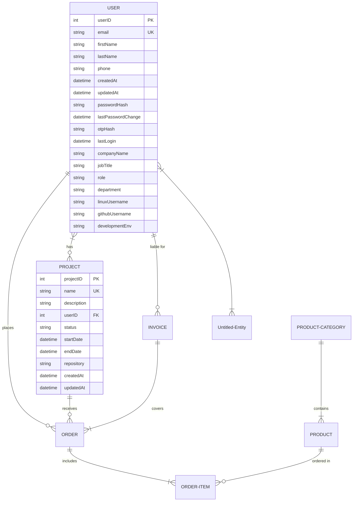

```mermaid
erDiagram
 direction TB
 USER {
  int userID PK ""
  string email UK ""
  string firstName  ""
  string lastName  ""
  string phone  ""
  datetime createdAt  ""
  datetime updatedAt  ""
  string passwordHash  ""
  datetime lastPasswordChange  ""
  string otpHash  ""
  datetime lastLogin  ""
  string companyName  ""
  string jobTitle  ""
  string role  ""
  string department  ""
  string linuxUsername  ""
  string githubUsername  ""
  string developmentEnv  ""
 }

 PROJECT {
  int projectID PK ""
  string name UK ""
  string description  ""
  int userID FK ""
  string status  ""
  datetime startDate  ""
  datetime endDate  ""
  string repository  ""
  datetime createdAt  ""
  datetime updatedAt  ""
 }


 USER}|--o{PROJECT:"has"
 USER||--o{ORDER:"places"
 USER||--o{INVOICE:"liable for"
 PROJECT||--o{ORDER:"receives"
 INVOICE||--|{ORDER:"covers"
 ORDER||--|{ORDER-ITEM:"includes"
 PRODUCT-CATEGORY||--|{PRODUCT:"contains"
 PRODUCT||--o{ORDER-ITEM:"ordered in"
 USER}|--|{Untitled-Entity:"  "
```
