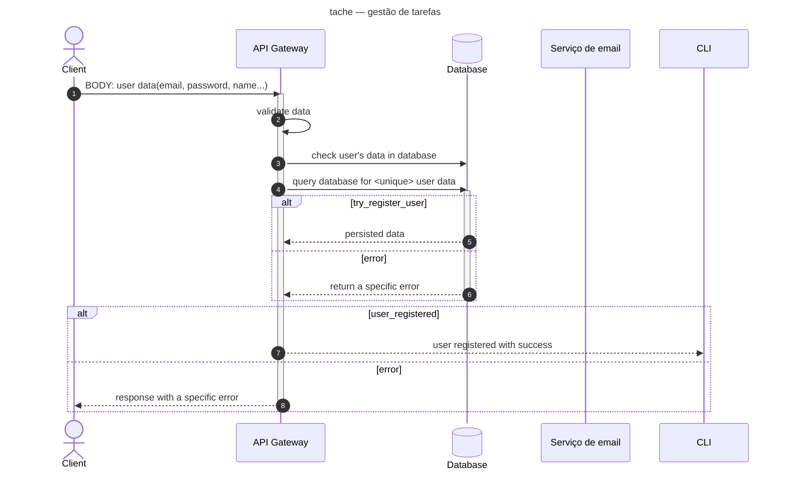

```mermaid
sequenceDiagram
    title: tache — gestão de tarefas
    autonumber
    actor Client
    participant API as API Gateway
    participant DB@{ "type" : "database" } as Database
    participant Email as Serviço de email

    Client ->> API: BODY: user data(email, password, name...)
    activate API
    API ->> API: validate data
    API ->> DB:  check user's data in database
    API ->> DB: query database for <unique> user data
    activate DB
    alt try_register_user
        DB -->> API: persisted data
    else error
        DB -->> API: return a specific error
    end
    deactivate DB
    alt user_registered
        API -->> CLI: user registered with success
    else error
        API -->> Client: response with a specific error
    end
    deactivate API
```
