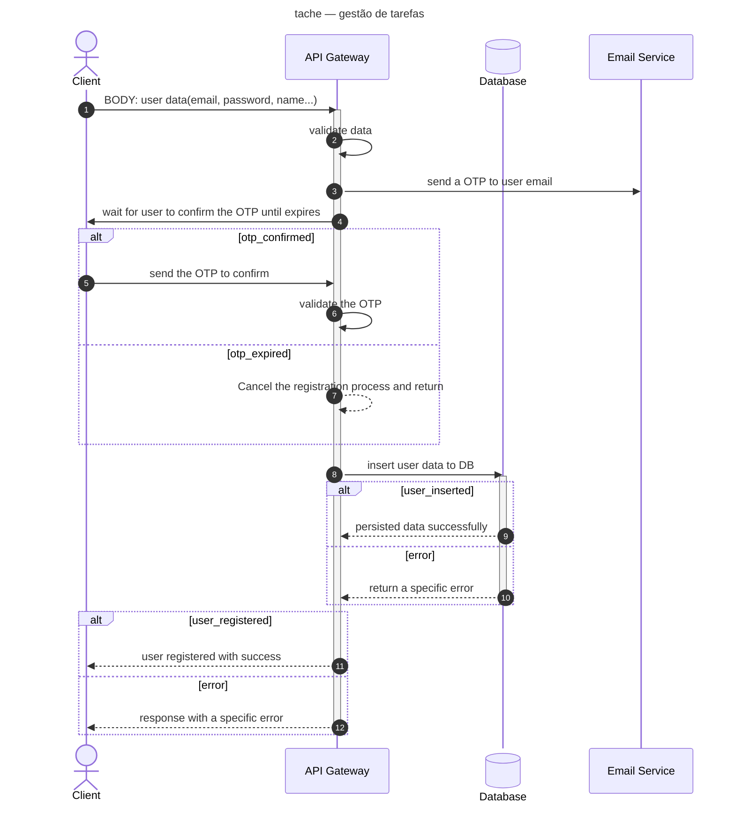

```mermaid
sequenceDiagram
    title: tache — gestão de tarefas
    autonumber
    actor Client
    participant API as API Gateway
    participant DB@{ "type" : "database" } as Database
    participant EMAIL as Email Service

    Client ->> API: BODY: user data(email, password, name...)
    activate API
    API ->> API: validate data
    API ->> EMAIL: send a OTP to user email
    API ->> Client: wait for user to confirm the OTP until expires
    alt otp_confirmed
        Client ->> API: send the OTP to confirm
        API ->> API: validate the OTP
    else otp_expired
        API -->> API: Cancel the registration process and return
    end
    API ->> DB:  insert user data to DB
    activate DB
    alt user_inserted
        DB -->> API: persisted data successfully
    else error
        DB -->> API: return a specific error
    end
    deactivate DB
    alt user_registered
        API -->> Client: user registered with success
    else error
        API -->> Client: response with a specific error
    end
    deactivate API
```
