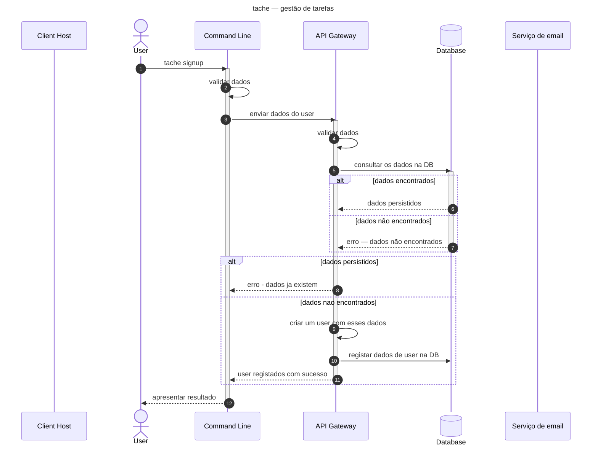

```mermaid
sequenceDiagram
    title: tache — gestão de tarefas
    autonumber
    participant Local as Client Host
    actor User
    participant CLI as Command Line
    participant API as API Gateway
    participant DB@{ "type" : "database" } as Database
    participant Email as Serviço de email

    User ->> CLI: tache signup
    activate CLI
    CLI ->> CLI: validar dados
    CLI ->> API: enviar dados do user
    activate API
    API ->> API: validar dados
    API ->> DB: consultar os dados na DB
    activate DB
    alt dados encontrados
        DB -->> API: dados persistidos
    else dados não encontrados
        DB -->> API: erro — dados não encontrados
    end
    deactivate DB
    alt dados persistidos
        API -->> CLI: erro - dados ja existem
    else dados nao encontrados
        API ->> API: criar um user com esses dados
        API ->> DB: registar dados de user na DB
        API -->> CLI: user registados com sucesso
    end
    deactivate API
    CLI -->> User: apresentar resultado
    deactivate CLI
```
